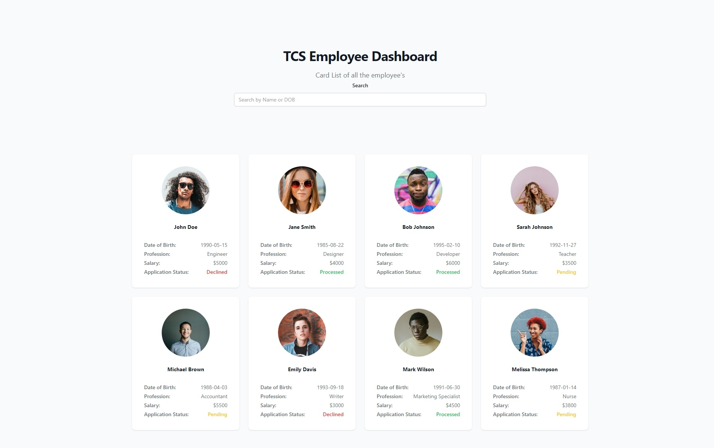

# Employee Dashboard

### Dashboard View



### User Details Page View


I am writing down all the steps below to setup and run the application.

## Project Setup

To run the project you need to open 2 terminals and run the server and client commands as below:

JSON-Server setup

```
cd tcs
sudo npm install -g json-server      // Install the json-server globally
sudo json-server -w ./data/db.js     // Starting the json-server
```

Vue.js Client setup

```
cd tcs
npm install
npm run build
npm run preview
```

## Recommended IDE Setup

[VSCode](https://code.visualstudio.com/) + [Volar](https://marketplace.visualstudio.com/items?itemName=Vue.volar) (and disable Vetur) + [TypeScript Vue Plugin (Volar)](https://marketplace.visualstudio.com/items?itemName=Vue.vscode-typescript-vue-plugin).
